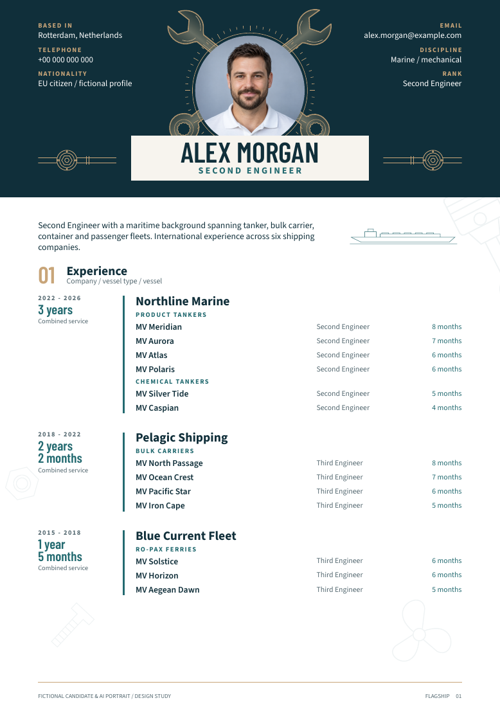
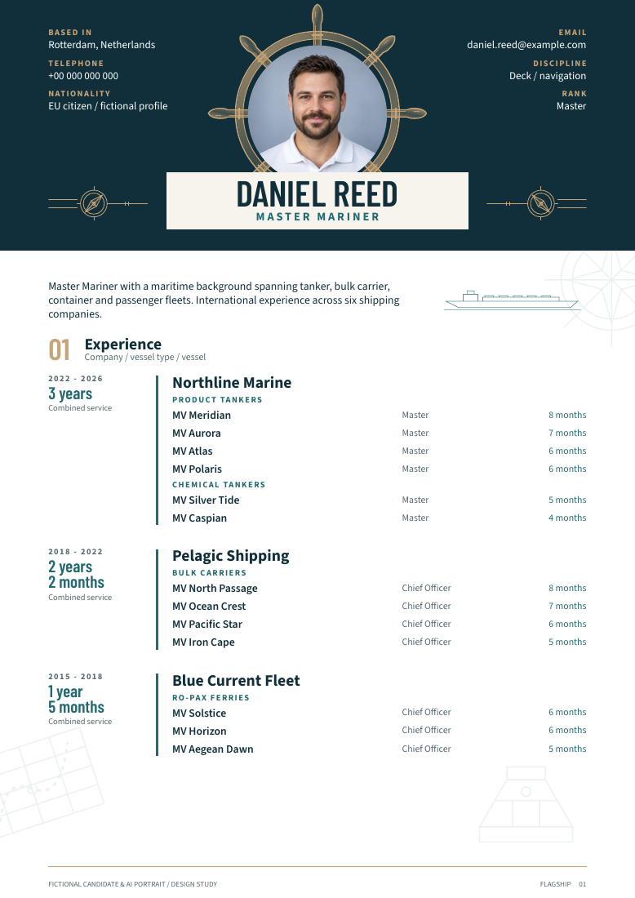
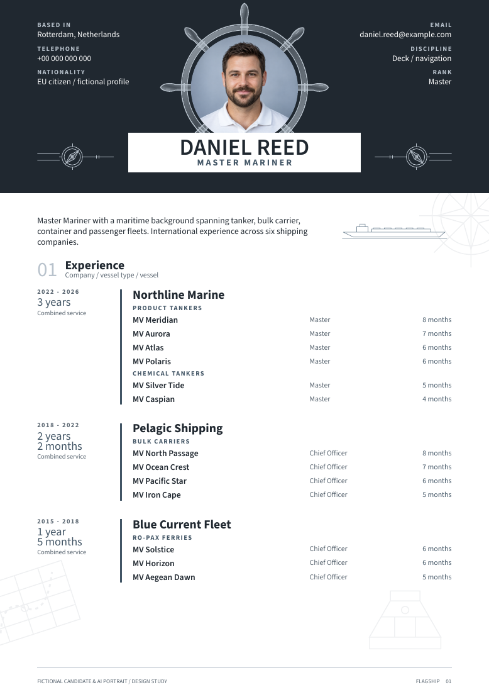

# Marine CV

A composable [Typst](https://typst.app) library for two-page maritime CVs.
One template, five independent inputs: candidate data, theme, artwork pack,
layout profile and a durations switch. Swap any one without touching the
others.

All names, employers, service histories and qualifications in this repository
are fictional. The portrait is AI-generated. This is a public template, not a
real candidate.

| Example | Inputs | Render |
|---|---|---|
| Engineer | Golden Blue theme, engineer artwork | [PDF](exports/Marine-Engineer-CV-v12.pdf) · [p1](docs/images/Marine-Engineer-CV-v12-page-1.png) · [p2](docs/images/Marine-Engineer-CV-v12-page-2.png) |
| Captain Classic | Golden Blue theme, captain artwork | [PDF](exports/Marine-Captain-CV-Classic-v01.pdf) · [p1](docs/images/Marine-Captain-CV-Classic-v01-page-1.png) · [p2](docs/images/Marine-Captain-CV-Classic-v01-page-2.png) |
| Captain Silver | Silver Bridge theme, captain artwork | [PDF](exports/Marine-Captain-CV-Silver-v01.pdf) · [p1](docs/images/Marine-Captain-CV-Silver-v01-page-1.png) · [p2](docs/images/Marine-Captain-CV-Silver-v01-page-2.png) |

<p align="center">
  
  
  
</p>

## Quick start

Install Typst 0.15.1 (`winget install --id Typst.Typst --exact` on Windows),
then from the repository root:

```powershell
./scripts/build.ps1
```

Three PDFs land in a new `builds/library-<timestamp>/` folder. No Python,
Node or online service is needed to build a CV. All fonts are bundled.

An example entry point is seven lines:

```typst
#import "../lib.typ": flagship
#import "../themes/golden-blue.typ": theme
#import "../artwork/engineer.typ": artwork
#import "../layouts/flagship-v11.typ": layout
#let candidate = json("../content/engineer-example.json")
#show: flagship.with(candidate: candidate, theme: theme, artwork: artwork, layout: layout,
  show-vessel-durations: true)
```

Change the JSON to change the person. Change the theme import to change the
look. Change the artwork import to change the illustrations. Change the layout
to change margins and which companies sit on which page.

## Where to go next

- Building a CV for a real person: [docs/guides/build-a-cv.md](docs/guides/build-a-cv.md)
- Candidate JSON fields: [docs/reference/candidate-schema.md](docs/reference/candidate-schema.md), validated by [schema/candidate.schema.json](schema/candidate.schema.json)
- How the pieces fit: [docs/architecture.md](docs/architecture.md)
- Rules, conventions and workflow: [docs/constitution.md](docs/constitution.md), [docs/conventions.md](docs/conventions.md), [docs/git-workflow.md](docs/git-workflow.md)
- Working with a coding agent: [AGENTS.md](AGENTS.md)
- The frozen design studies this library grew from: [designs/](designs/README.md)

## Verification

```powershell
python tests/run.py
```

Needs Python with `pymupdf` and `pillow`. The suite compiles 22 cases and
proves the engineer example renders pixel-identical to the frozen
[v11 reference](reference/Marine-Engineer-CV-v11.pdf). Details in
[docs/reference/verification.md](docs/reference/verification.md).

Rendered PDFs contain selectable text and embedded fonts, and decorative art is
tagged as PDF artifacts. That is not a commercial ATS certification. Check
reading order against the actual application portal.

## Licences

Project code and original illustrations are MIT, see [LICENSE](LICENSE).
Bundled fonts (Source Sans 3, Barlow Condensed, Cormorant Garamond) are under
the SIL Open Font License, notices in [licenses/](licenses/). The experience
helper pattern is adapted from Cobalt CV 0.1.0 (MIT), notice preserved.
