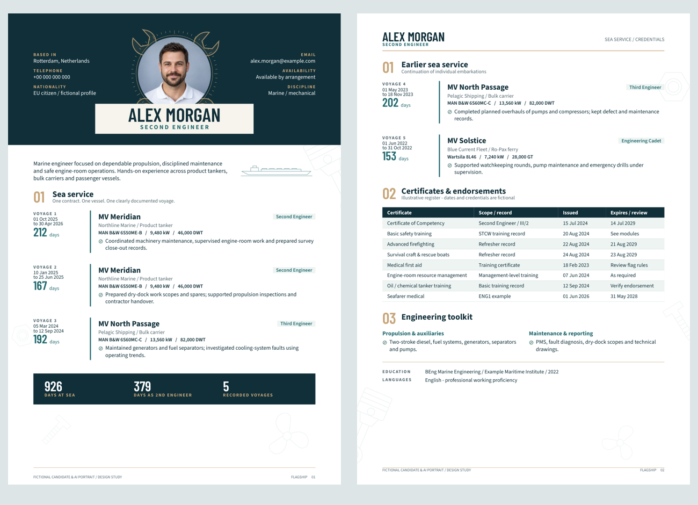
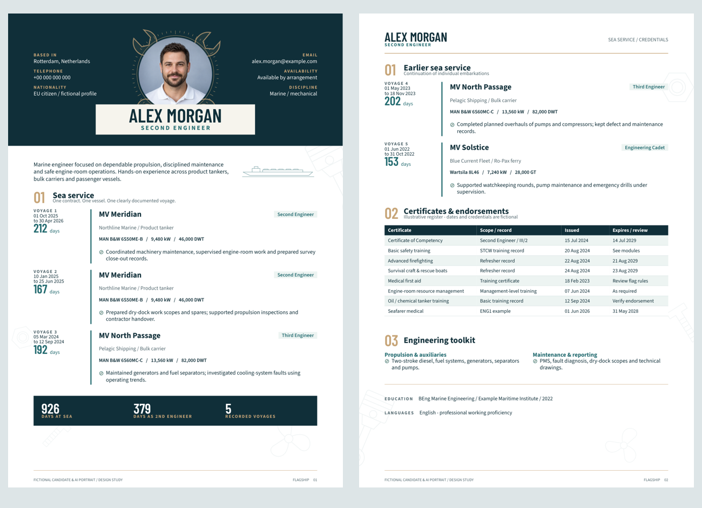
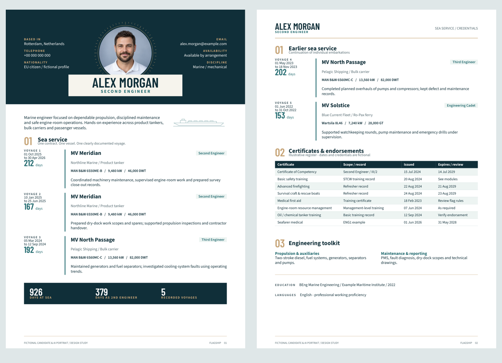
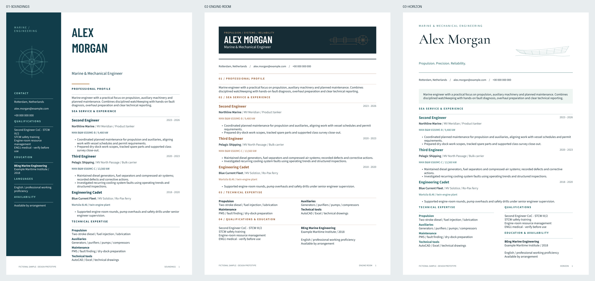

# Marine Engineer CV Studio

Editable Typst resume prototypes and refinements for marine and mechanical engineers. All names, employers, service histories and qualifications are fictional demonstration content. This is a public template repository, not a real candidate profile.

## Current revision / spacing refinement

[Open the refined two-page PDF](exports/review/06-flagship-spacing.pdf)



This pass changes body spacing only. A shared spacing scale replaces accumulated paragraph gaps; each voyage uses the same metadata spacing, timeline padding and separation. Certificate rows have 3 mm horizontal and 2.2 mm vertical padding, with 9.5 pt text. Education and languages share a fixed label column. Page margins, the portrait hero, illustrations, wording and colour palette remain unchanged.

The first 83 mm of page one were rendered and compared against Mechanical v2: pixel-identical. Whitespace-normalized extracted text also matches the previous edition exactly. Both pages were inspected and checked for embedded fonts and text bounds. The record is in `spacing-verification.json`.

Edit `designs/06-flagship-spacing.typ`; shared body distances are defined in its `space` dictionary. Earlier design files and reviewed PDFs remain available for comparison.

```powershell
typst compile --root . --font-path fonts designs/06-flagship-spacing.typ spacing-local.pdf
```

## Flagship Mechanical / SVG detail study

[Open the latest two-page PDF](exports/review/05-flagship-mechanical-v2.pdf)



This edition adds original crossed combination spanners behind the circular portrait, miniature slotted screw-head list markers, and sparse piston, nut, bolt and propeller outlines around the page edges. The background uses 8.5% opacity rather than raster blur, keeping the PDF sharp and lightweight in its vector detail. Some edge ornaments are intentionally cropped by the page. Text and data remain live Typst content. All new decorative assets and list-marker images are marked as PDF artifacts so they do not add meaningless descriptions to the reading structure. This is not an ATS certification.

The four new SVG files are original project artwork and use the project MIT licence. Edit `designs/05-flagship-mechanical.typ` to tune their size and placement. The content and synthetic portrait are shared with Flagship. The previous editions remain available for comparison.

```powershell
typst compile --root . --font-path fonts designs/05-flagship-mechanical.typ mechanical-local.pdf
```

## Flagship / two-page portrait edition

The newest design introduces a centered circular portrait framed by drafting marks, contact details on both sides, and a name/rank plate overlapping the portrait's lower edge. Deep navy, warm brass and a pale nameplate establish a distinct maritime identity.

[Open the two-page Flagship PDF](exports/review/04-flagship-v2.pdf)



Each embarkation is a separate timeline entry, even when the ship and employer repeat. Five fictional voyages include sign-on/sign-off dates, rank, machinery and power. The certificate register uses a different table structure for scope, issue and expiry/review dates. All certificate details are illustrative, not advice on legal validity or endorsements. No real certificate numbers or scans are included.

Edit `content/flagship-example.json` and `designs/04-flagship.typ`. The first three voyages appear on page one; the remainder continue on page two. Longer content can flow to additional pages, but pagination and the fixed portrait header require visual review after editing. The portrait in `assets/fictional-engineer.png` is AI-generated and depicts no identified candidate. Replace it with the candidate's own authorised photograph in a private working copy.

The sample's day totals are calculated as calendar days between sign-on and sign-off inclusive: 926 days across five voyages, including 379 as Second Engineer. This demonstration convention is not a certification of qualifying sea service. The nameplate intentionally overlaps only the lower 4 mm of the portrait, leaving the face unobscured. Body text is 10-10.5 pt; certificate rows are 9 pt.

Build only this edition into a new PDF:

```powershell
typst compile --root . --font-path fonts designs/04-flagship.typ flagship-local.pdf
```

## Earlier one-page studies



| Prototype | Design direction | PDF |
|---|---|---|
| Soundings | Deep petrol sidebar, compass geometry, condensed name. The strongest nautical identity. | [View PDF](exports/review/01-soundings.pdf) |
| Engine Room | Graphite masthead, copper accents, original shaft-line illustration, numbered sections. The most explicit mechanical-engineering direction. | [View PDF](exports/review/02-engine-room.pdf) |
| Horizon | Editorial serif name, teal detailing and an original hull-line illustration. The most spacious direction. | [View PDF](exports/review/03-horizon.pdf) |

## Local setup

Install Typst on Windows: `winget install --id Typst.Typst --exact`. Reopen the terminal and check `typst --version`. These prototypes were built with Typst 0.15.1. No Python, Node, RenderCV, icon fonts, or paid services are required to build them. All required fonts are bundled under their OFL licences.

Run from PowerShell:

```powershell
./build.ps1
```

The script writes all six numbered designs/revisions to a new timestamped `builds/` directory and refuses to overwrite an existing output directory. If local PowerShell policy prevents running scripts, compile directly to a new filename:

```powershell
typst compile --root . --font-path fonts designs/01-soundings.typ soundings-local.pdf
```

For continuous editing, choose a disposable output filename and run:

```powershell
typst watch --root . --font-path fonts designs/03-horizon.typ horizon-preview.pdf
```

Watch mode intentionally updates its chosen preview PDF every time you save. `main.typ` selects Soundings by default.

## Project structure

- `content/example.json`: the single source of fictional CV content used by all three designs.
- `designs/shared.typ`: reusable entry and section formatting.
- `designs/01-soundings.typ`, `02-engine-room.typ`, `03-horizon.typ`: distinct page compositions.
- `assets/`: original SVG illustrations, ornamental and not scale drawings.
- `fonts/` and `licenses/`: bundled fonts and all attribution/licence information.
- `exports/review/`: reviewed one-page PDF prototypes.
- `previews/review/`: page images for comparison.
- `verification.json`: build and document inspection results.

## Editing and design choices

Edit the data file to change experience, qualifications and contact details. Colours, proportions and typography live in the design files. The fictional qualifications deliberately avoid certificate numbers and must be replaced with accurate details before any real application. Employment dates are not a claim of actual time at sea; add verified sea-service dates and totals for a real candidate.

The shared experience/category helper pattern is adapted from Cobalt CV 0.1.0 by Vikram Saraph (MIT). Soundings develops its sidebar/main-column composition. Neat CV supplied visual inspiration for flexible sidebar placement; no Neat CV source is incorporated. The mechanical and maritime artwork, three new compositions and data separation are original work for this project.

These are one-page design studies for the supplied content. Soundings has a fixed-height sidebar and needs deliberate pagination for a longer CV; the other designs also need review after content changes. Neither photographs nor skill-rating bars are needed for these prototypes.

## Parsing and accessibility

All three reviewed PDFs contain extractable text and embedded fonts. Names, contact details, engineering roles and qualifications were checked. Text bounds stay inside the page. Every final page was visually inspected. This is not certification by a commercial ATS. Sidebar reading order and multi-column qualifications should be checked against the actual application portal. Decorative drawings do not carry any essential CV information.

For a conservative portal submission, Engine Room has the clearest full-width experience flow. All designs use visible content only, with no hidden keywords. The body is 10 pt (sidebar 9.5 pt); a production CV may benefit from 10.5-11 pt and a second page depending on content.

Keep real personal data in a separate private copy or a `private/` directory (ignored here). Do not commit certificate scans, passport details or private references to this public repository.

## Sources and licences

- [Cobalt CV 0.1.0](https://typst.app/universe/package/cobalt-cv/), MIT; preserved notice in `licenses/cobalt-cv-MIT.txt`.
- [Neat CV](https://typst.app/universe/package/neat-cv/), visual reference only.
- [Source Sans 3](https://github.com/google/fonts/tree/main/ofl/sourcesans3), [Barlow Condensed](https://github.com/google/fonts/tree/main/ofl/barlowcondensed), [Cormorant Garamond](https://github.com/google/fonts/tree/main/ofl/cormorantgaramond), SIL Open Font License; each notice preserved in `licenses/`.
- [Typst CLI](https://github.com/typst/typst).

Project code and original illustrations are MIT licensed. Font licences remain separate.
